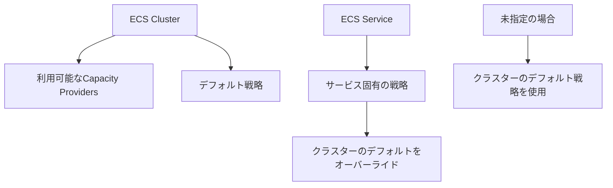

# Capacity Provider 設定レベルの詳細解説

## クラスターレベル vs サービスレベルの違い

### 設定の階層構造



## 1. クラスターレベルの設定

### 役割: **「利用可能なオプションの定義」**

```typescript
// クラスターで利用可能なCapacity Providersを定義
this.cluster = new ecs.Cluster(this, 'ApacheCluster', {
  clusterName: 'apache-cluster',
  enableFargateCapacityProviders: true,  // 👈 利用可能にする
});
```

**効果:**
- ✅ FARGATE と FARGATE_SPOT が利用可能になる
- ✅ デフォルト戦略が設定される
- ❌ サービスの実際の動作は変わらない

### CloudFormation での出力

```yaml
ApacheCluster:
  Type: AWS::ECS::Cluster
  Properties:
    ClusterName: apache-cluster
    CapacityProviders:              # 👈 利用可能なプロバイダー
      - FARGATE
      - FARGATE_SPOT
    DefaultCapacityProviderStrategy: # 👈 デフォルト戦略
      - CapacityProvider: FARGATE
        Weight: 1
        Base: 0
```

## 2. サービスレベルの設定

### 役割: **「実際の使用戦略の指定」**

```typescript
// サービスで実際に使用する戦略を指定
const service = new ecs.FargateService(this, 'ApacheService', {
  cluster: this.cluster,
  taskDefinition: this.taskDefinition,
  capacityProviderStrategies: [      // 👈 実際の使用戦略
    {
      capacityProvider: 'FARGATE_SPOT',
      weight: 1,
    },
  ],
});
```

**効果:**
- ✅ 実際にFARGATE_SPOTを使用する
- ✅ タスクがSpot料金で実行される
- ✅ クラスターのデフォルトをオーバーライド

## 詳細比較表

| 設定レベル | 目的 | 設定内容 | 影響範囲 | 実際の動作への影響 |
|-----------|------|---------|---------|-------------------|
| **クラスター** | 利用可能オプション定義 | `enableFargateCapacityProviders` | クラスター全体 | なし（デフォルト提供のみ） |
| **サービス** | 実際の使用戦略 | `capacityProviderStrategies` | 個別サービス | あり（実際の実行方法を決定） |

## 実際の設定パターン

### パターン1: クラスターのみ設定（現在）

```typescript
// クラスター: Capacity Providers有効化
this.cluster = new ecs.Cluster(this, 'ApacheCluster', {
  enableFargateCapacityProviders: true,
});

// サービス: 戦略指定なし
const service = new ecs.FargateService(this, 'ApacheService', {
  cluster: this.cluster,
  // capacityProviderStrategies 指定なし
});
```

**結果:**
- 🎯 クラスターのデフォルト戦略（FARGATE）を使用
- 🎯 通常のFargate料金で実行
- 🎯 選択肢は用意されているが使用していない

### パターン2: サービスで戦略指定

```typescript
// クラスター: 前提として有効化
this.cluster = new ecs.Cluster(this, 'ApacheCluster', {
  enableFargateCapacityProviders: true,
});

// サービス: Spot戦略を明示的に指定
const service = new ecs.FargateService(this, 'ApacheService', {
  cluster: this.cluster,
  capacityProviderStrategies: [
    {
      capacityProvider: 'FARGATE_SPOT',  // 👈 実際にSpotを使用
      weight: 1,
    },
  ],
});
```

**結果:**
- 🎯 FARGATE_SPOTで実行
- 🎯 最大70%のコスト削減
- 🎯 中断リスクあり

### パターン3: 環境別の戦略

```typescript
export class EcsApplicationStack extends cdk.Stack {
  constructor(scope: Construct, id: string, props?: EcsApplicationStackProps) {
    super(scope, id, props);

    // クラスター: 全ての選択肢を有効化
    this.cluster = new ecs.Cluster(this, 'ApacheCluster', {
      enableFargateCapacityProviders: true,
    });

    // 環境別の戦略取得
    const environment = this.node.tryGetContext('environment') || 'dev';
    const strategy = this.getCapacityStrategy(environment);

    // サービス: 環境に応じた戦略
    const service = new ecs.FargateService(this, 'ApacheService', {
      cluster: this.cluster,
      capacityProviderStrategies: strategy,
    });
  }

  private getCapacityStrategy(env: string) {
    switch (env) {
      case 'prod':
        return [
          { capacityProvider: 'FARGATE', weight: 2, base: 1 },      // 安定性
          { capacityProvider: 'FARGATE_SPOT', weight: 1 },          // コスト
        ];
      case 'staging':
        return [
          { capacityProvider: 'FARGATE_SPOT', weight: 1 },          // コスト重視
        ];
      default: // dev
        return [
          { capacityProvider: 'FARGATE_SPOT', weight: 1 },          // 最大コスト削減
        ];
    }
  }
}
```

## よくある誤解と正しい理解

### ❌ 誤解: クラスター設定だけで動作が変わる

```typescript
// これだけではサービスの動作は変わらない
enableFargateCapacityProviders: true
```

### ✅ 正しい理解: サービスレベルで実際の戦略を指定

```typescript
// クラスター: 選択肢を提供
enableFargateCapacityProviders: true

// サービス: 実際の戦略を選択
capacityProviderStrategies: [
  { capacityProvider: 'FARGATE_SPOT', weight: 1 }
]
```

## なぜ2段階に分かれているのか？

### 1. **管理の分離**
- **クラスター管理者**: 利用可能な選択肢を定義
- **サービス開発者**: 適切な戦略を選択

### 2. **セキュリティ**
- クラスターレベルで制限可能
- 承認されたCapacity Providersのみ使用

### 3. **柔軟性**
- 同一クラスター内で異なる戦略
- 環境別・サービス別の最適化

## 現在のプロジェクトでの推奨アプローチ

### フェーズ1: クラスター準備（現在）

```typescript
// 選択肢を準備するだけ
this.cluster = new ecs.Cluster(this, 'ApacheCluster', {
  enableFargateCapacityProviders: true,  // 👈 準備のみ
});

// サービスはデフォルト（通常Fargate）
const service = new ecs.FargateService(this, 'ApacheService', {
  cluster: this.cluster,
  // 戦略指定なし = デフォルト使用
});
```

### フェーズ2: 開発環境でSpot試用

```typescript
// クラスター設定は同じ

// 開発環境でSpot試用
const service = new ecs.FargateService(this, 'ApacheService', {
  cluster: this.cluster,
  capacityProviderStrategies: [
    { capacityProvider: 'FARGATE_SPOT', weight: 1 },
  ],
});
```

### フェーズ3: 本番環境で混合戦略

```typescript
// 本番環境で安定性とコストのバランス
capacityProviderStrategies: [
  { capacityProvider: 'FARGATE', weight: 1, base: 1 },      // 最低限の安定性
  { capacityProvider: 'FARGATE_SPOT', weight: 2 },          // コスト最適化
]
```

## まとめ

### 設定の役割分担

| レベル | 役割 | 現在の設定 | 実際の動作への影響 |
|--------|------|-----------|-------------------|
| **クラスター** | 選択肢の提供 | `enableFargateCapacityProviders: true` | なし |
| **サービス** | 実際の選択 | 未設定（デフォルト使用） | あり |

### 現在の状態

```typescript
// ✅ 現在: 準備は完了、使用はデフォルト
enableFargateCapacityProviders: true  // 選択肢準備
// capacityProviderStrategies なし     // デフォルト使用

// 結果: 通常FARGATEで動作（コスト標準、安定性高）
```

### 将来の選択肢

```typescript
// 🔄 将来: サービスレベルで戦略選択
capacityProviderStrategies: [
  { capacityProvider: 'FARGATE_SPOT', weight: 1 }  // コスト削減
]
```

**結論**: クラスター設定は「準備」、サービス設定が「実行」を決定します。現在は準備完了状態で、必要に応じてサービスレベルで戦略を選択できます！