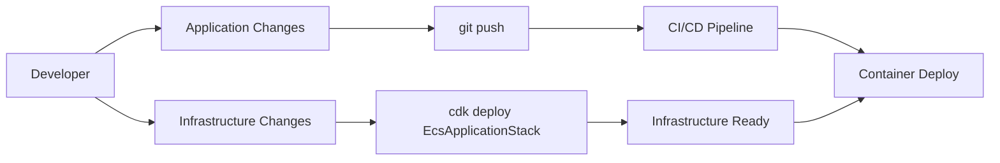
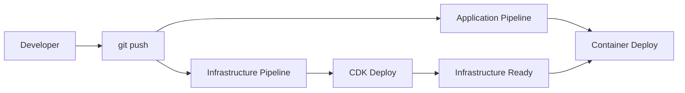

# デプロイメント戦略の比較 (Deployment Strategy Comparison)

## 現在の推奨アプローチ vs 完全自動化アプローチ

### アプローチ1: ハイブリッド方式（現在・推奨）



**特徴:**
- **インフラ**: 手動 `cdk deploy`
- **アプリケーション**: 自動 CI/CD

### アプローチ2: 完全自動化方式



**特徴:**
- **インフラ**: 自動 CI/CD
- **アプリケーション**: 自動 CI/CD

## 詳細比較表

| 観点 | ハイブリッド方式 | 完全自動化方式 |
|------|------------------|----------------|
| **セキュリティ** | ⭐⭐⭐⭐⭐ | ⭐⭐⭐ |
| **運用の安全性** | ⭐⭐⭐⭐⭐ | ⭐⭐⭐ |
| **開発速度** | ⭐⭐⭐⭐ | ⭐⭐⭐⭐⭐ |
| **学習コスト** | ⭐⭐⭐⭐ | ⭐⭐ |
| **障害時の対応** | ⭐⭐⭐⭐⭐ | ⭐⭐⭐ |
| **コスト** | ⭐⭐⭐⭐⭐ | ⭐⭐⭐ |

## アプローチ1: ハイブリッド方式の利点

### ✅ セキュリティ面
```typescript
// インフラ変更は人間による承認が必要
// 意図しないリソース作成・削除を防止
npx cdk diff EcsApplicationStack  // 変更確認
npx cdk deploy EcsApplicationStack  // 明示的なデプロイ
```

### ✅ 運用安全性
```bash
# インフラ変更前の確認プロセス
1. コードレビュー
2. cdk diff での変更内容確認
3. 手動デプロイによる最終承認
4. 段階的な反映
```

### ✅ コスト効率
- インフラ変更は低頻度 → CI/CDパイプライン維持コスト不要
- アプリ変更は高頻度 → CI/CD効果大

### ✅ 障害時の対応
```bash
# 問題発生時の切り分けが明確
- インフラ問題: CDKコード確認
- アプリ問題: CI/CDパイプライン確認
```

## アプローチ2: 完全自動化の利点

### ✅ 開発効率
```yaml
# 全てが自動化されるため手順が統一
git push
↓
Infrastructure Deploy
↓
Application Deploy
```

### ✅ 一貫性
- 全ての変更が同じプロセスを通る
- 人的ミスの削減

## 実際の運用での推奨事項

### 🎯 **小規模〜中規模チーム**: ハイブリッド方式

**理由:**
1. **インフラ変更頻度**: 週1回未満
2. **アプリ変更頻度**: 日数回〜数十回
3. **セキュリティ要件**: 高い
4. **学習コスト**: 抑えたい

**実装例:**
```bash
# 日常的な開発フロー
git add src/
git commit -m "新機能追加"
git push origin main
# → 自動的にCI/CDでコンテナデプロイ

# インフラ変更時（週1回程度）
git add lib/ecs-application-stack.ts
git commit -m "ALBのヘルスチェック設定変更"
npx cdk diff EcsApplicationStack
npx cdk deploy EcsApplicationStack
```

### 🎯 **大規模チーム**: 完全自動化方式

**理由:**
1. **チーム規模**: 10人以上
2. **環境数**: dev/staging/prod など複数
3. **デプロイ頻度**: インフラも高頻度
4. **DevOps成熟度**: 高い

## 移行パスの提案

### フェーズ1: 現在の状態（推奨維持）
```typescript
// EcsApplicationStack: 手動デプロイ
// EcsCicdStack: コンテナ自動デプロイ
```

### フェーズ2: 段階的自動化（必要に応じて）
```typescript
// 1. Infrastructure CI/CD Pipeline追加
export class InfrastructureCicdStack extends cdk.Stack {
  // EcsApplicationStackのデプロイを自動化
}

// 2. 環境別デプロイ
// dev環境: 完全自動化
// prod環境: 手動承認付き自動化
```

### フェーズ3: 完全自動化（大規模時のみ）
```typescript
// 全スタックのCI/CD化
```

## 具体的な実装パターン

### パターン1: 現在の推奨方式
```bash
# プロジェクト構成
├── lib/
│   ├── ecs-application-stack.ts    # 手動デプロイ
│   └── ecs-cicd-stack.ts          # コンテナ自動デプロイ
├── buildspec.yml                   # アプリビルド仕様
└── Dockerfile                     # アプリコンテナ
```

### パターン2: インフラCI/CD追加時
```bash
# 拡張された構成
├── lib/
│   ├── ecs-application-stack.ts
│   ├── ecs-cicd-stack.ts
│   └── infrastructure-cicd-stack.ts  # 新規追加
├── buildspec.yml
├── infrastructure-buildspec.yml       # 新規追加
└── Dockerfile
```

## 判断基準

### ハイブリッド方式を選ぶべき場合
- [ ] チーム規模: 5人以下
- [ ] インフラ変更: 月数回以下
- [ ] セキュリティ要件: 高い
- [ ] CDK学習段階: 初期〜中級
- [ ] 本番運用: 慎重さを重視

### 完全自動化を選ぶべき場合
- [ ] チーム規模: 10人以上
- [ ] インフラ変更: 週数回以上
- [ ] 複数環境: 3つ以上
- [ ] DevOps成熟度: 高い
- [ ] 開発速度: 最優先

## 結論

**現在のハイブリッド方式が最適**な理由：

1. **🛡️ 安全性**: インフラ変更の慎重な管理
2. **⚡ 効率性**: 高頻度なアプリデプロイの自動化
3. **💰 コスト**: 必要最小限のCI/CDリソース
4. **📚 学習**: CDKとCI/CDの段階的習得
5. **🔧 保守**: 問題切り分けの明確さ

**移行は必要に応じて段階的に実施**することを推奨します。