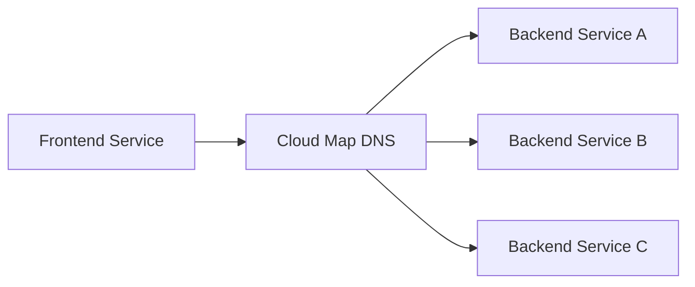
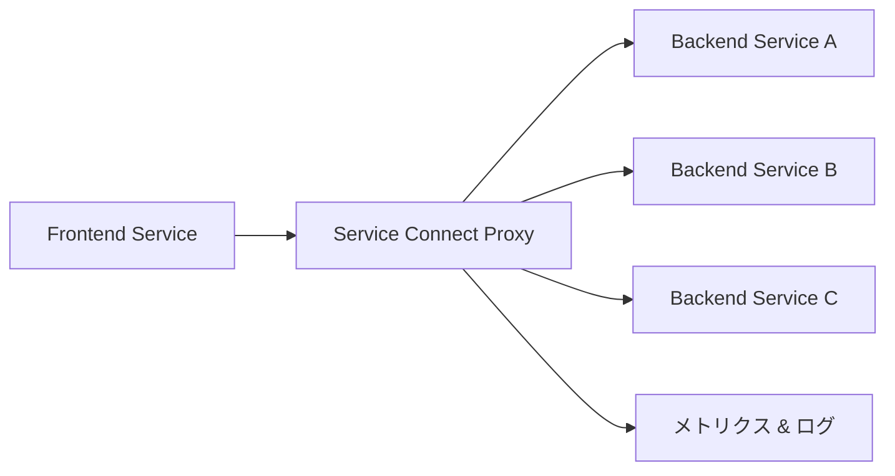

# ECS Service Connect の詳細解説

## `useForServiceConnect: true` の効果

### 現在の設定での違い

**❌ 現在 (`useForServiceConnect: false`)**
```typescript
defaultCloudMapNamespace: {
  name: 'apache.local',
  useForServiceConnect: false,  // 従来のCloud Map DNS
  vpc: this.vpc,
}
```

**✅ Service Connect有効 (`useForServiceConnect: true`)**
```typescript
defaultCloudMapNamespace: {
  name: 'apache.local',
  useForServiceConnect: true,   // Service Connect機能
  vpc: this.vpc,
}
```

## Service Connect とは？

ECS Service Connectは、**マイクロサービス間の通信を簡素化する機能**です。

### 主な機能

1. **🔍 サービス発見**: DNS名でサービスを見つける
2. **⚖️ ロードバランシング**: 自動的にトラフィック分散
3. **🔄 ヘルスチェック**: 不健全なインスタンスを自動除外
4. **📊 観測性**: 詳細なメトリクスとログ
5. **🛡️ 回復力**: 自動リトライと回路ブレーカー

## 従来方式 vs Service Connect

### 従来のCloud Map DNS



**課題:**
- アプリケーション側でロードバランシング実装が必要
- ヘルスチェックをアプリで管理
- 障害時の処理が複雑

### Service Connect



**利点:**
- ✅ 自動ロードバランシング
- ✅ 自動ヘルスチェック
- ✅ 詳細な観測性
- ✅ 透明なプロキシ

## 現在のApacheアプリケーションでの影響

### Single Service の場合（現在）

現在のApacheアプリケーションは**単一サービス**なので、Service Connectの恩恵は**限定的**です：

```typescript
// 現在の構成
Apache Service (単体) ← ALB ← Internet
```

**Service Connect有効化の効果:**
- ✅ 将来のマイクロサービス拡張に備える
- ✅ 詳細なメトリクス取得
- ⚠️ 若干のオーバーヘッド（プロキシコンテナ追加）

### Multi-Service の場合（将来の拡張）

Service Connectが真価を発揮する構成：

```typescript
// 将来のマイクロサービス構成例
Frontend Service → Backend API → Database Service
    ↓              ↓              ↓
Service Connect経由で安全・簡単に通信
```

## 実装方法の比較

### 現在の方式のまま
```typescript
defaultCloudMapNamespace: {
  name: 'apache.local',
  useForServiceConnect: false,  // シンプル
}
```

### Service Connect有効化
```typescript
defaultCloudMapNamespace: {
  name: 'apache.local',
  useForServiceConnect: true,   // 拡張性重視
}

// サービス定義でService Connect設定が必要
const service = new ecs.FargateService(this, 'ApacheService', {
  // 既存設定...
  serviceConnectConfiguration: {
    namespace: 'apache.local',
    services: [
      {
        portMappingName: 'http',
        discoveryName: 'apache',
        clientAliases: [
          {
            port: 80,
            dnsName: 'apache',
          },
        ],
      },
    ],
  },
});

// タスク定義でポート名が必要
taskDefinition.addContainer('ApacheContainer', {
  // 既存設定...
  portMappings: [
    {
      containerPort: 80,
      protocol: ecs.Protocol.TCP,
      name: 'http',  // Service Connect用の名前
    },
  ],
});
```

## メトリクスと観測性の向上

### Service Connect有効時の追加メトリクス

```bash
# CloudWatchで取得可能なメトリクス例
ECS/ServiceConnect/RequestCount
ECS/ServiceConnect/ResponseTime
ECS/ServiceConnect/ErrorRate
ECS/ServiceConnect/ConnectionCount
```

### ログの詳細化

```json
{
  "source_service": "frontend",
  "destination_service": "apache",
  "status_code": 200,
  "response_time_ms": 45,
  "proxy_type": "envoy"
}
```

## コスト影響

### 追加リソース
- **Service Connect Proxy**: 各タスクに自動追加
- **メモリ**: 約64MB〜128MB追加
- **CPU**: 最小限の追加使用量

### 計算例
```bash
# 現在: 2タスク × 512MB = 1024MB
# Service Connect有効: 2タスク × (512MB + 128MB) = 1280MB
# 増加率: 約25%
```

## 推奨判断

### 🎯 現在のプロジェクトでの推奨: `false` のまま

**理由:**
1. **Single Service**: 現在はApacheのみでService Connect恩恵が少ない
2. **コスト**: 25%のリソース増加
3. **複雑性**: 追加設定が必要
4. **学習**: まずは基本構成をマスター

### ✅ 将来的にService Connect有効化を検討すべき場合

```typescript
// 例: マイクロサービス化時
Frontend Service  ←→  Apache Service  ←→  API Service
     ↓                     ↓                  ↓
Service Connect で全て接続して観測性・信頼性向上
```

**タイミング:**
- [ ] 複数サービスに分割する時
- [ ] 観測性を重視する本番運用時
- [ ] トラフィック量が増加した時

## まとめ

```typescript
// 現在: シンプル重視で継続推奨
useForServiceConnect: false

// 将来: マイクロサービス化時に有効化
useForServiceConnect: true
```

現在は単一サービスなので**従来方式で十分**です。将来的にサービスを分割する際にService Connectを検討しましょう！